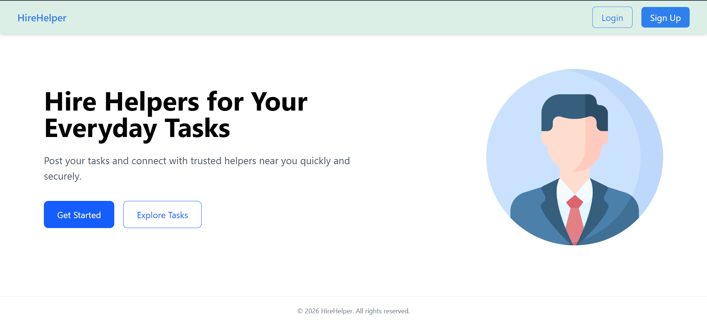
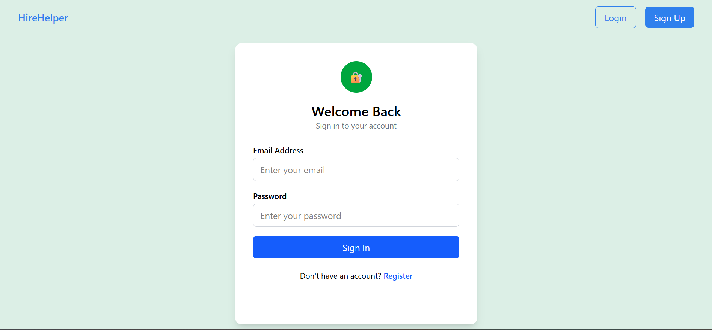
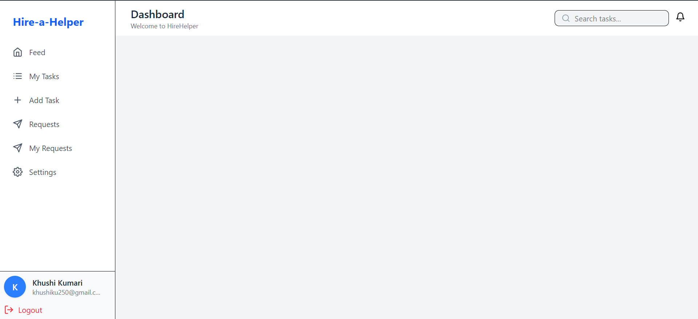
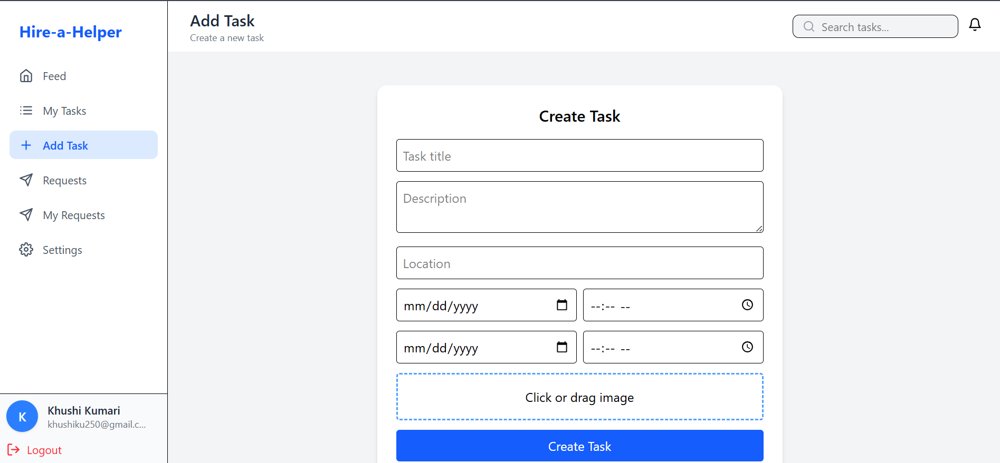
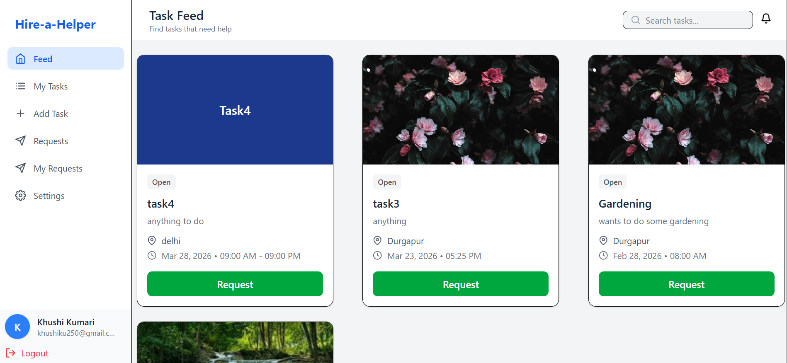
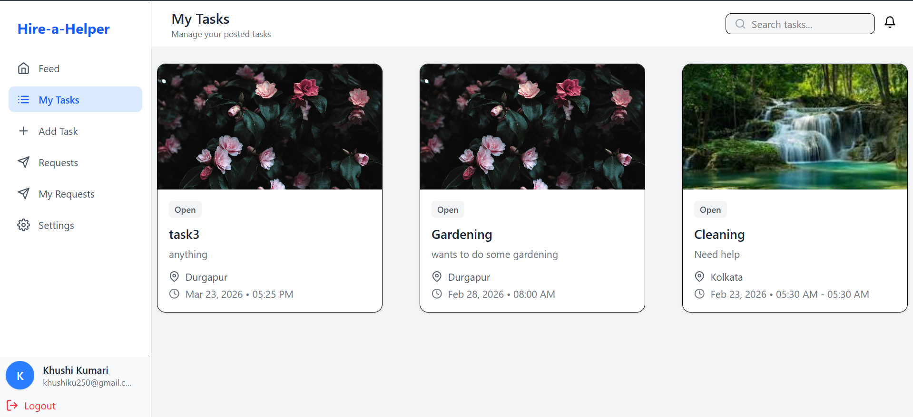
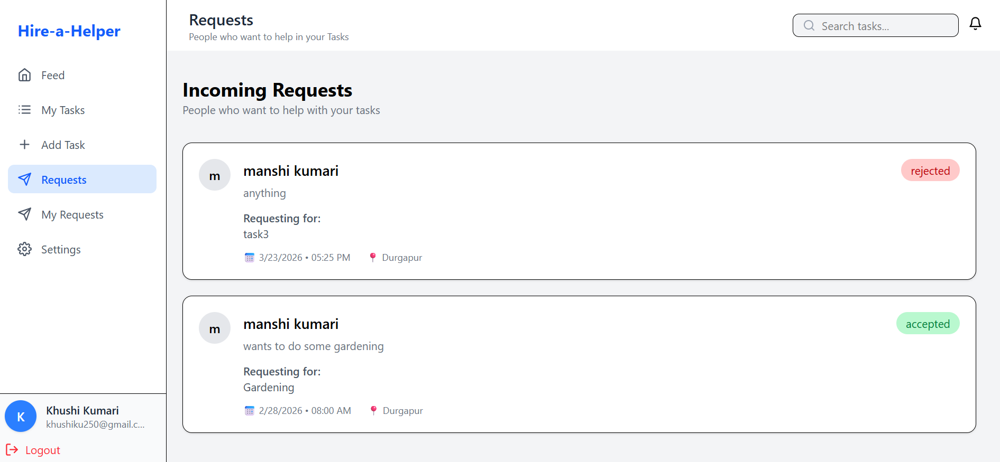
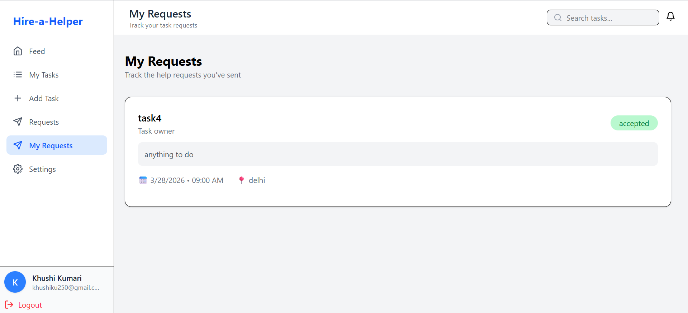
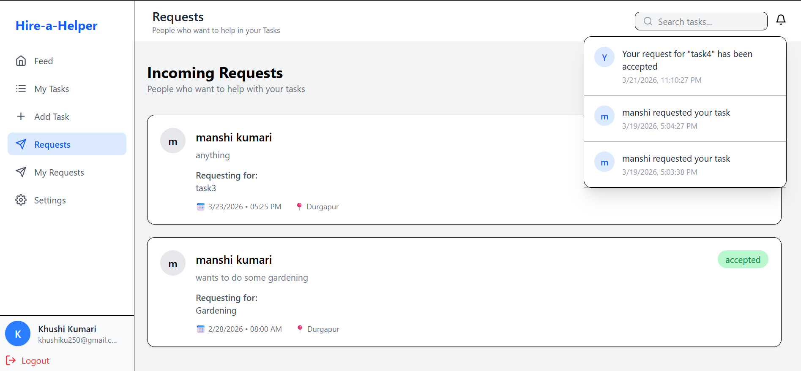

# 🚀 HireHelper – Full Stack Task Hiring Platform

HireHelper is a **full-stack web application** that connects users who need help with everyday tasks to people willing to complete them.

It provides a complete workflow:  
➡️ Task Creation → Request Sending → Accept/Reject → Notifications → Task Management



---

## 📌 Project Overview

HireHelper allows users to:

- Post tasks with complete details  
- Browse and request tasks  
- Manage incoming and outgoing requests  
- Receive real-time notifications  
- Update profile and account settings  

📄 Detailed System Design: (Included in project files)

---

## 🧩 Core Modules

- 🔐 Authentication & Profile Management  
- 📌 Task Posting & Discovery  
- 🔄 Request Handling System  
- 🔔 Notification System  
- 📊 Dashboard & Navigation  

---

## 🚀 Features

---

### 🔐 Authentication System



- User Registration & Login  
- Email OTP Verification (Nodemailer)  
- JWT Authentication  
- Protected Routes  
- Toast Notifications  

---

### 📊 Dashboard



- Sidebar Navigation  
- Search Bar  
- Notification Icon  
- Clean UI Layout  

---

### 📌 Task Management

#### ➕ Add Task



- Title & Description  
- Location & Time Selection  
- Optional Image Upload (Cloudinary)  
- Clean Form UI  

---

#### 📰 Task Feed



- View all tasks  
- Request button  
- Responsive UI  
- Time & location display  

---

#### 📁 My Tasks



- View created tasks  
- Image support  
- Organized layout  

---

### 🔄 Request System

#### 📥 Incoming Requests



- Accept / Reject requests  
- User details  
- Status updates  

---

#### 📤 My Requests



- Track sent requests  
- Status (Pending / Accepted / Rejected)  

---

### 🔔 Notifications



- New request alerts  
- Accept/Reject updates  
- Unread badge  
- Mark as read  

---

### ⚙️ Settings


- Update profile info  
- Change password  
- Profile picture upload  
- Account management  

---

## 🔗 API Endpoints

### 🔹 Tasks

- `POST /api/tasks/create`  
- `GET /api/tasks/allTasks`  
- `GET /api/tasks/myTask`  

### 🔹 Requests

- `POST /api/requests/send`  
- `GET /api/requests/received`  
- `GET /api/requests/myRequests`  
- `PUT /api/requests/accept/:id`  
- `PUT /api/requests/reject/:id`  

### 🔹 Notifications

- `GET /api/notifications`  
- `PUT /api/notifications/read/:id`  

---

## 🛠️ Tech Stack

### Frontend

- React.js  
- Tailwind CSS  
- React Router DOM  
- Axios  
- React Toastify  
- React Icons  

### Backend

- Node.js  
- Express.js  
- MongoDB  
- Mongoose  
- JWT Authentication  
- Nodemailer  
- Cloudinary  
- Express FileUpload  

---

## 📁 Folder Structure


HireHelper/
│
├── frontend/
│ ├── components/
│ ├── pages/
│ ├── services/
│ └── App.jsx
│
├── backend/
│ ├── controllers/
│ ├── routes/
│ ├── models/
│ ├── middleware/
│ └── utils/
│
├── screenshots/


---

## ⚙️ Installation & Setup

### 1️⃣ Clone Repository

```bash
git clone https://github.com/your-username/HireHelper.git
cd HireHelper
2️⃣ Backend Setup
cd backend
npm install
npm run dev
3️⃣ Frontend Setup
cd frontend
npm install
npm run dev
🔐 Environment Variables

Create .env file in backend:

MONGODB_URL=your_mongodb_url
PORT=4000

JWT_SECRET=your_secret

MAIL_USER=your_email
MAIL_PASS=your_email_password

CLOUD_NAME=your_cloud_name
API_KEY=your_api_key
API_SECRET=your_api_secret
🚧 Project Status

✅ Authentication System
✅ Task Management
✅ Request System
✅ Notifications
✅ Settings Page

🎉 Project Completed Successfully

💡 Future Enhancements
Real-time chat between users
Payment integration
Task rating & reviews
Advanced filtering & search